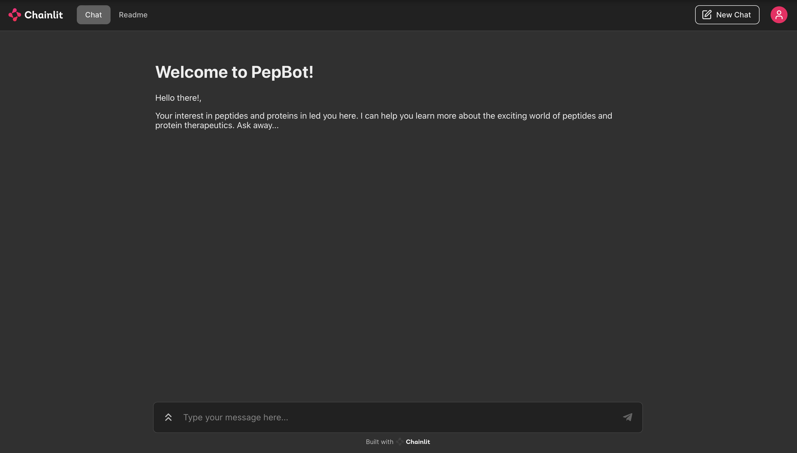
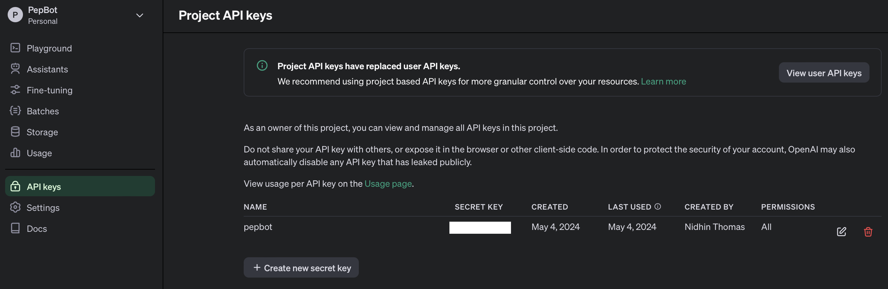
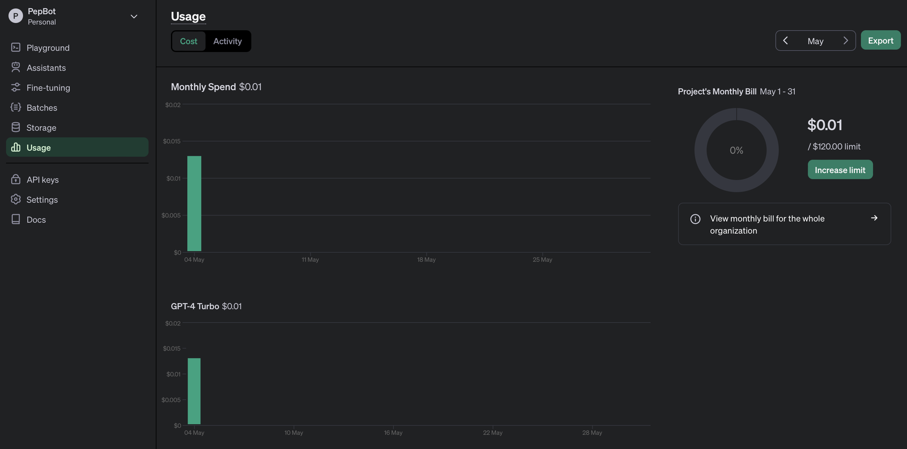
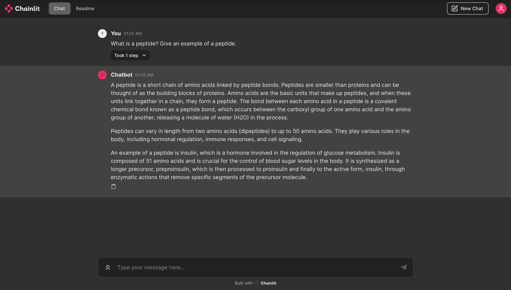

# PepBot: Building a Chatbot in Chainlit Using Langchain and OpenAI

## Summary
This repository contains a quick way to build a custom chatbot in Chainlit through Langchain and OpenAI API. Before you begin, ensure that you have a the relevant packages installed and access to OpenAI API.



## Pre-requisites

### OpenAI API:

PepBot uses gpt-4-turbo through OpenAI API. You must create a profile in OpenAI API and create a new API Key for this project before building PepBot.

Your proflie after creating the API Key would like this:

**WARNING:** The API Key you create is unique to a user and a project, and must be kept private and not shared with anyone.



The API KEY would be shown only once. You should copy the API_KEY when asked and saved in a private file for now. 

After you create a profile in OpenAI API, ensure that you have not exceeded the Quota Limit. You may have to pay in advance to buy the quota to keep using the API. As you chat with PepBot, you will be charged and a fixed amount ($) depending upon the frequency of the query and the underlying GPT model that you use. If you check the Usage within OpenAI API, your dashboard should look like this:



### Downloading the Repository:
Clone the repository from GitHub to your local machine:

```bash
git clone https://github.com/nidhinthomas-ai/PepBot
cd PepBot-main
```

### Repository Layout:

The repository is organized as follows:
```bash
PepBot-main/  
├── app.py
├── chainlit.md
├── assets
│   ├── PepBot.png  
│   ├── PepBot_Response.png 
│   ├── OpenAI_API_Key.png  
│   └── OpenAI_Usage.png
├── .env 
├── README.md  
└── requirements.txt 
```

### Creating a Conda Environment:
To ensure compatibility and manage dependencies, it is recommended to create a new conda environment for this project:

```bash
conda create --name pepbot_langchain python=3.8
conda activate pepbot_langchain
```

### Install required packages:
```bash
pip install -r requirements.txt
```

### .env file:

The .env file contains the API Key:

```bash
OPENAI_API_KEY="Your_OPENAI_API_KEY"
```

### To Launch PepBot:

```bash
chainlit run app.py -w
```

For more detailed instructions on each script and additional options, refer to the respective documentation in chainlit (https://docs.chainlit.io/integrations/openai).

